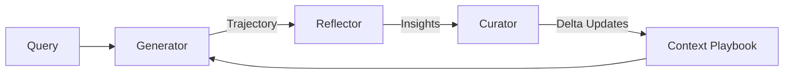

# LightRAG Enhancement Implementation Plan

## Overview

This plan transforms the TODO.md items into actionable phases, prioritized for a working system first with early evaluation integration.

## Project Priorities

| Priority | Description |
|----------|-------------|
| **p0** | Highest priority - must be done first |
| **p1** | Next-highest priority - after p0 complete |
| **p2** | Lower priority - nice to have |

---

## Phase 0a: Update AGENT_INSTRUCTIONS.md (p0) ✅ COMPLETE

> [!NOTE]
> Completed: Rewrote with Python examples for LightRAG project.

**Beads:** `lightrag-n6b` (closed)

---

## Phase 0b: Model Profiling (p0) ⬅️ IN PROGRESS

> [!IMPORTANT]
> Profile all downloaded Ollama models to ensure the most performant ones are configured in `.env`.

### Goals
1. List all available Ollama models
2. Run performance benchmarks on each model
3. Update `.env` with optimal model selections

### Tasks
```bash
# 1. List available models
ollama list

# 2. Run profiling tests on each model
# (specific benchmarking approach TBD based on available models)

# 3. Update .env with best-performing models for:
#    - LLM_MODEL (entity extraction, query answering)
#    - EMBEDDING_MODEL (vector embeddings)
```

### Current Configuration
- LLM: `qwen2.5-coder:1.5b` (switched due to 7b performance issues)
- Need to validate this is still optimal

---

## Phase 1: Core System Stability (p0)

> [!IMPORTANT]
> A working system that processes the BCBC PDF document, creates a graph, and handles queries properly is the top priority.

### Goals
1. Verify end-to-end document processing with `final_report_BCBC.pdf`
2. Confirm graph visualization works
3. Validate query responses are accurate

### Current Status
- Timeout configuration already updated to 9000s (2.5 hours) for PDF processing
- LLM model set to `qwen2.5-coder:1.5b` for local performance
- Server starts via: `cd LightRAG && uv sync --extra api && uv run lightrag-server`

### Verification

#### Test 1: BCBC PDF Processing
```bash
# 1. Start the LightRAG server
cd /Users/marchansen/claude_test/LightRAG
uv run lightrag-server

# 2. Upload final_report_BCBC.pdf via WebUI at http://localhost:9621
# 3. Monitor document status until PROCESSED
# 4. Verify no timeout errors in lightrag.log
```

#### Test 2: Graph Visualization  
- Open WebUI at http://localhost:9621
- Navigate to graph visualization
- Verify entities and relationships from BCBC document are visible

#### Test 3: Query Validation
```bash
# Run a sample query against the processed content
curl -X POST http://localhost:9621/query \
  -H "Content-Type: application/json" \
  -d '{"query": "What are the main findings in the BCBC report?", "mode": "hybrid"}'
```

---

## Phase 2: Evaluation Framework (Early Integration)

> [!NOTE]
> RAGAS and Langfuse are already integrated in LightRAG. This phase focuses on activating and validating them.

### RAGAS Integration

**Already Available:**
- `lightrag/evaluation/eval_rag_quality.py` - Main evaluation script
- `lightrag/evaluation/sample_dataset.json` - Sample test questions
- Install with: `pip install -e ".[evaluation]"`

#### New Work
1. Create BCBC-specific test dataset with domain questions
2. Run baseline evaluation to establish metrics
3. Document baseline scores for future comparison

#### Verification
```bash
# Run RAGAS evaluation
cd /Users/marchansen/claude_test/LightRAG
pip install -e ".[evaluation]"
python lightrag/evaluation/eval_rag_quality.py --dataset bcbc_test_dataset.json
```

### Langfuse Integration

**Already Available:**
- Built-in tracing support
- Configure via `.env` variables

#### [MODIFY] [.env](file:///Users/marchansen/claude_test/LightRAG/.env)

Enable Langfuse tracing (self-hosted):
```
LANGFUSE_SECRET_KEY="<your-key>"
LANGFUSE_PUBLIC_KEY="<your-key>"
LANGFUSE_HOST="http://localhost:3000"  # Self-hosted instance
LANGFUSE_ENABLE_TRACE=true
```

> [!NOTE]
> Langfuse will be self-hosted, so no cloud credentials needed.

#### Verification
- After enabling, run queries and verify traces appear in Langfuse dashboard
- Check token usage, latency, and cost metrics

---

## Phase 3: ACE Framework Integration (Minimal Prototype)

> [!NOTE]
> Starting with a minimal ACE prototype to validate the architecture before full implementation.

Implement the 3-component ACE architecture for self-improving context:

### Architecture Overview



### Component Design

#### Generator Component
- **Role**: Solves queries using existing Context Playbook
- **Input**: Query + Current Playbook
- **Output**: Reasoning Trajectory + Answer

#### Reflector Component
- **Role**: Critiques execution, extracts lessons
- **Input**: Generator's trajectory + execution results
- **Output**: Concrete Insights (successes/errors)

#### Curator Component
- **Role**: Synthesizes insights into playbook updates
- **Input**: Reflector's insights
- **Output**: Delta Context Items (incremental updates)
- **Key Innovation**: Prevents context collapse via incremental edits

### Proposed File Structure

```
lightrag/
├── ace/
│   ├── __init__.py
│   ├── generator.py      # [NEW] Query execution with playbook
│   ├── reflector.py      # [NEW] Trajectory critique and insights
│   ├── curator.py        # [NEW] Playbook delta updates
│   ├── playbook.py       # [NEW] Context playbook storage/retrieval
│   └── config.py         # [NEW] ACE configuration
```

### Verification
- Unit tests for each component
- Integration test: Query → Generate → Reflect → Curate cycle
- Verify playbook evolution across multiple queries

---

## Phase- [ ] **Phase 5: Browser Compatibility (Safari)**
  - [x] Investigate Safari rendering regression ([lightrag-h7x](bd://lightrag-h7x))
  - [ ] Apply `-webkit-backdrop-filter` prefixes in `SiteHeader.tsx`, `App.tsx`, `DocumentManager.tsx`
  - [ ] Fix flexbox/absolute height resolution issues in `App.tsx` and `DocumentManager.tsx`
  - [ ] Update `h-screen` to `h-dvh` for better modern browser support
  - [ ] Rebuild and verify via user feedback

- [ ] **Phase 4: Enhancements**
  - [ ] MCP integration (client + server)
  - [ ] Citation links in query results
  - [ ] Ongoing self-improvement suggestions (`lightrag-9a9`)
  - [ ] Ongoing memory updates (`lightrag-o4q`)
Support both MCP Server and Client modes:

#### MCP Server Mode
- Expose LightRAG as an MCP server
- Other agents can query the knowledge graph

#### MCP Client Mode  
- LightRAG consumes external MCP resources
- Enhance retrieval with external data sources

### Keyword Search (p1)
- Add keyword/full-text search alongside vector search
- Hybrid retrieval: vector + keyword

### Citation Links (p1)
- Extend query responses with citation links to original sources
- Use `source_id` tracking already in LightRAG

### Performance Optimization (p2)
- Profiling to identify slowdowns
- Parallel embedding processing
- Consider Memgraph for vector-enabled graph storage

---

## Decisions Made

- **Phase ordering**: Confirmed (profiling → stability → evaluation → ACE → enhancements)
- **ACE approach**: Minimal prototype first
- **Langfuse**: Self-hosted (no cloud credentials needed)
- **MCP use cases**: TBD - will suggest when more context gathered

---

## Verification Summary

| Phase | Test Type | Command/Steps |
|-------|-----------|---------------|
| 1: Stability | Manual | Upload PDF, verify processing, test queries via WebUI |
| 2: RAGAS | Automated | `python lightrag/evaluation/eval_rag_quality.py` |
| 2: Langfuse | Manual | Verify traces in Langfuse dashboard |
| 3: ACE | Unit Tests | `pytest tests/test_ace_*.py` (to be created) |
| 4: MCP | Integration | Test MCP server/client connections |
