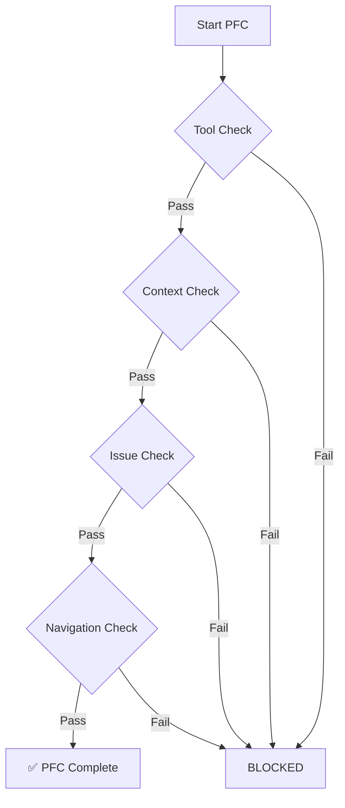
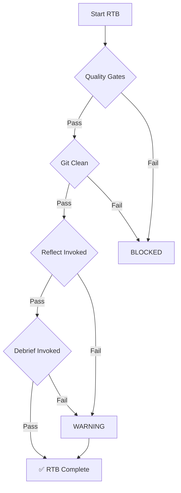

# Flight Director Skill

The Flight Director acts as an **agent orchestrator**, verifying that each step of the Standard Mission Protocol (SMP) is completed adequately and that appropriate skills are invoked at the right times.

## Usage

```bash
# Pre-Flight Check validation
python ~/.gemini/antigravity/skills/FlightDirector/scripts/check_flight_readiness.py --pfc

# Return To Base validation
python ~/.gemini/antigravity/skills/FlightDirector/scripts/check_flight_readiness.py --rtb

# Full orchestration status
python ~/.gemini/antigravity/skills/FlightDirector/scripts/check_flight_readiness.py --status
```

## Purpose

Position as the **central orchestrator** that:

1. **Verifies SOP Compliance**: Checks that each PFC and RTB step is completed
2. **Validates Skill Invocation**: Ensures appropriate skills are used at each phase
3. **Gates Progression**: Blocks transitions if prerequisites aren't met
4. **Reports Status**: Provides clear pass/fail reporting for each checkpoint

## Orchestration Phases

### Phase 1: Pre-Flight Check (PFC)



**Verifies**:

- [ ] Tools available (`bd`, `uv`, etc.)
- [ ] Planning documents readable
- [ ] Beads issue exists
- [ ] Plan approval fresh (< 4 hours)

### Phase 2: In-Flight Operations (IFO)

**Passive Monitoring** - Flight Director doesn't block during IFO but logs:

- Task progress updates
- Significant decisions
- Skill invocations

### Phase 3: Return To Base (RTB)



**Verifies**:

- [ ] Quality gates passed
- [ ] Git status clean
- [ ] Reflect skill invoked
- [ ] Mission Debriefing skill invoked (warning if not)

## Skill Invocation Verification

Flight Director verifies these skills are invoked at appropriate times:

| Phase | Skill | Required |
|-------|-------|----------|
| PFC | `mission-briefing` | Recommended |
| PFC | `devils-advocate` | Recommended for complex tasks |
| RTB | `reflect` | **Required** |
| RTB | `mission-debriefing` | **Required** |

## Output Format

### Pass Example

```
✅ PFC COMPLETE
├── Tools: ✅ All required tools available
├── Context: ✅ Planning documents accessible  
├── Issues: ✅ Beads issue LIGHTRAG-123 assigned
└── Approval: ✅ Plan approved 2 hours ago

Ready for takeoff!
```

### Fail Example

```
❌ PFC BLOCKED
├── Tools: ✅ All required tools available
├── Context: ❌ ImplementationPlan.md not found
├── Issues: ✅ Beads issue LIGHTRAG-123 assigned
└── Approval: ⚠️ Plan approval is 5 hours old (stale)

BLOCKERS:
1. Create implementation plan before proceeding
2. Re-approve plan (approval expires after 4 hours)
```

## Integration

The Flight Director integrates with:

- **SMP Protocol**: Enforces PFC/IFO/RTB workflow
- **Beads**: Validates issue assignment and status
- **Skills**: Verifies skill invocation at each phase
- **Git**: Validates repository state

## Error Handling

If Flight Director itself fails:

1. Check Python environment: `python3 --version`
2. Verify script exists: `ls ~/.gemini/antigravity/skills/FlightDirector/scripts/`
3. Check file permissions: `chmod +x check_flight_readiness.py`
4. Run with verbose: `--verbose` flag for detailed output

## Configuration

Flight Director reads configuration from:

- Project-level: `.agent/flight_director.yaml`
- Global-level: `~/.gemini/antigravity/flight_director.yaml`

### Config Options

```yaml
pfc:
  require_beads_issue: true
  plan_approval_hours: 4
  required_tools:
    - bd
    - git

rtb:
  require_reflection: true
  require_debriefing: true
  block_on_dirty_git: true
```
