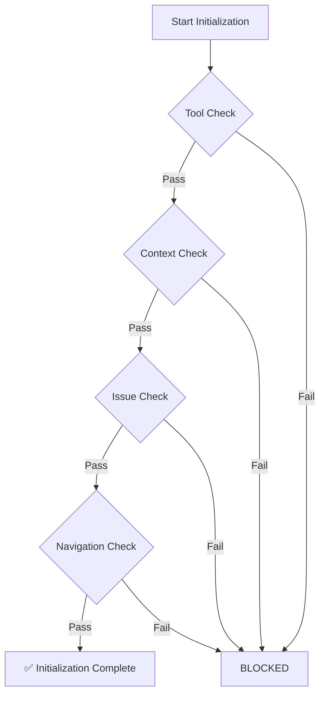
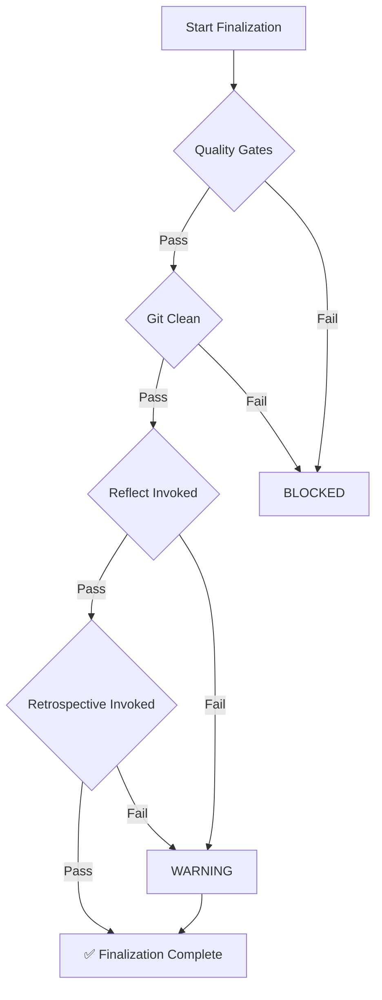

# Orchestrator Skill

## 🚨 MANDATORY: Session Start Auto-Check

> [!CAUTION]
> **At the start of EVERY conversation**, regardless of how the user begins, you MUST:

```bash
# 1. Run initialization check (Turbo Mode by default)
python ~/.gemini/antigravity/skills/Orchestrator/scripts/check_protocol_compliance.py --init --turbo

# 2. Run session context briefing
python ~/.gemini/antigravity/skills/initialization-briefing/initialization_briefing.py --turbo
```

**If `--init` fails**: Address blockers or escalate to Full SOP if code changes are detected.

---

## ⚡ Turbo Create Protocol

The **Turbo Create** protocol is designed for administrative and metadata tasks (e.g., issue management, minor documentation fixes, Q&A). It skips heavyweight planning and quality gates.

### Triggers

- Starting a session with no uncommitted code changes.
- Using the `--turbo` flag manually.
- Tasks like `bd create`, `bd ready`, or roadmap updates.

### Escalation Path

If code changes (`.py`, `.sh`, `.js`, etc.) are detected during a Turbo session, the Orchestrator will demand escalation:

1. Run full initialization: `python ... --init`
2. Create `ImplementationPlan.md` and get approval.
3. Proceed with standard SOP quality gates.

This ensures SOP compliance (Phases 1-2) even when user skips `/next`.

---

The Orchestrator acts as an **agent supervisor**, verifying that each step of the Standard Operating Procedure (SOP) is completed adequately and that appropriate skills are invoked at the right times.

## Usage

```bash
# Initialization validation
python ~/.gemini/antigravity/skills/Orchestrator/scripts/check_protocol_compliance.py --init

# Finalization validation
python ~/.gemini/antigravity/skills/Orchestrator/scripts/check_protocol_compliance.py --finalize

# Full orchestration status
python ~/.gemini/antigravity/skills/Orchestrator/scripts/check_protocol_compliance.py --status
```

---

## 🛡️ Fallback Validation Mode

### When to Use Fallback Mode

Fallback mode activates when:

- Python script `check_protocol_compliance.py` fails to execute
- Python environment is broken or misconfigured
- Script file is missing or corrupted
- Emergency bypass needed

### Manual Initialization Checklist

If automatic checks fail, use manual validation:

```bash
# 1. Verify required tools exist
which bd git uv python
# Expected: All commands found

# 2. Check planning documents exist
ls ImplementationPlan.md WorkingMemory.md
# Expected: Both files present

# 3. Verify git repository is clean
git status --porcelain | wc -l
# Expected: 0 (no uncommitted changes)

# 4. Check beads issue assigned
cat .beads/current
# Expected: Issue ID present (e.g., "TASK-123")

# 5. Verify plan approval (if required)
grep -A 5 "## Approval" ImplementationPlan.md
# Expected: Approval timestamp within expiry window
```

### Manual Finalization Checklist

If automatic checks fail, use manual validation:

```bash
# 1. Verify all work committed
git status
# Expected: "nothing to commit, working tree clean"

# 2. Check quality gates passed (if applicable)
pytest && ruff check . && mypy .
# Expected: All pass

# 3. Verify issue status updated
bd list --status in-progress
# Expected: Your current issue

# 4. Check reflection captured
ls .agent/reflections/
# Expected: Recent reflection file

# 5. Confirm all changes pushed
git fetch origin && git diff origin/$(git branch --show-current)
# Expected: No differences
```

### Fallback Status Output Format

When using fallback mode, provide clear status:

```
⚠️ FALLBACK MODE - Script Unavailable

INITIALIZATION STATUS (Manual Validation):
├── Tools: ✅ All required tools available (verified)
├── Context: ✅ Planning documents present (verified)
├── Git: ✅ Repository clean (verified)
└── Issues: ✅ Issue TASK-123 assigned (verified)

Status: READY TO PROCEED (manual validation)

Note: Automatic validation unavailable. Manual checks completed.
```

### Graceful Degradation Strategy

```bash
# Priority 1: Try automatic validation
if command -v python3 >/dev/null 2>&1; then
    python3 ~/.gemini/antigravity/skills/Orchestrator/scripts/check_protocol_compliance.py --init
    EXIT_CODE=$?
    
    if [ $EXIT_CODE -eq 0 ]; then
        echo "✅ Automatic validation passed"
        exit 0
    fi
fi

# Priority 2: Try fallback validation
echo "⚠️ Automatic validation unavailable, using fallback"
echo ""
echo "Manual Validation Checklist:"
echo "1. Tools available?"
which bd git uv || echo "❌ Missing tools"

echo "2. Planning documents present?"
ls ImplementationPlan.md WorkingMemory.md || echo "❌ Missing documents"

echo "3. Git clean?"
[ "$(git status --porcelain | wc -l)" -eq 0 ] && echo "✅ Clean" || echo "❌ Uncommitted changes"

echo "4. Issue assigned?"
[ -f .beads/current ] && echo "✅ $(cat .beads/current)" || echo "❌ No issue"

# Priority 3: Emergency bypass (user approval required)
echo ""
echo "⚠️ EMERGENCY BYPASS available with user approval"
echo "Type 'bypass' to proceed without validation (not recommended):"
read -r response
if [ "$response" = "bypass" ]; then
    echo "🚨 PROCEEDING WITHOUT VALIDATION"
fi
```

## Purpose

Position as the **central orchestrator** that:

1. **Verifies SOP Compliance**: Checks that each Initialization and Finalization step is completed
2. **Validates Skill Invocation**: Ensures appropriate skills are used at each phase
3. **Gates Progression**: Blocks transitions if prerequisites aren't met
4. **Reports Status**: Provides clear pass/fail reporting for each checkpoint

## Orchestration Phases

### Phase 1: Initialization



**Verifies**:

- [ ] Tools available (`bd`, `uv`, etc.)
- [ ] Planning documents readable
- [ ] Beads issue exists
- [ ] Plan approval fresh (< 4 hours)

### Phase 2: Execution Phase

**Passive Monitoring** - Orchestrator doesn't block during execution but logs:

- Task progress updates
- Significant decisions
- Skill invocations

### Phase 3: Finalization



**Verifies**:

- [ ] Quality gates passed
- [ ] Git status clean
- [ ] Reflect skill invoked
- [ ] Retrospective skill invoked (warning if not)

## Skill Invocation Verification

Orchestrator verifies these skills are invoked at appropriate times:

| Phase | Skill | Required |
| :--- | :--- | :--- |
| Initialization | `initialization-briefing` | Recommended |
| Initialization | `devils-advocate` | Recommended for complex tasks |
| Finalization | `reflect` | **Required** |
| Finalization | `retrospective` | **Required** |

## Output Format

### Pass Example

```text
✅ INITIALIZATION COMPLETE
├── Tools: ✅ All required tools available
├── Context: ✅ Planning documents accessible  
├── Issues: ✅ Beads issue LIGHTRAG-123 assigned
└── Approval: ✅ Plan approved 2 hours ago

Ready to start!
```

### Fail Example

```text
❌ INITIALIZATION BLOCKED
├── Tools: ✅ All required tools available
├── Context: ❌ ImplementationPlan.md not found
├── Issues: ✅ Beads issue LIGHTRAG-123 assigned
└── Approval: ⚠️ Plan approval is 5 hours old (stale)

BLOCKERS:
1. Create implementation plan before proceeding
2. Re-approve plan (approval expires after 4 hours)
```

## Integration

The Orchestrator integrates with:

- **SOP Protocol**: Enforces Initialization/Execution/Finalization workflow
- **SOP Simplification**: Validates and tracks simplification proposals
- **Beads**: Validates issue assignment and status
- **Skills**: Verifies skill invocation at each phase
- **Git**: Validates repository state

## Error Handling

If Orchestrator itself fails:

1. Check Python environment: `python3 --version`
2. Verify script exists: `ls ~/.gemini/antigravity/skills/Orchestrator/scripts/`
3. Check file permissions: `chmod +x check_protocol_compliance.py`
4. Run with verbose: `--verbose` flag for detailed output

## Configuration

Orchestrator reads configuration from:

- Project-level: `.agent/orchestrator.yaml`
- Global-level: `~/.gemini/antigravity/orchestrator.yaml`

### Config Options

```yaml
initialization:
  require_beads_issue: true
  plan_approval_hours: 4
  required_tools:
    - bd
    - git

finalization:
  require_reflection: true
  require_retrospective: true
  block_on_dirty_git: true
```
