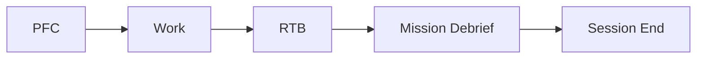

# Mission Debriefing Skill

**Separate phase** after RTB for strategic learning and session closure.

## Usage

```bash
/mission-debriefing
python ~/.gemini/antigravity/skills/mission-debriefing/scripts/mission_debriefing.py
```

## Workflow



**RTB** = Safe landing (quality gates, git, PR)  
**Mission Debrief** = Strategic learning (reflect, handoff, analysis)

## Debrief Steps

### 1. Reflect

Invoke `/reflect` to:

- Capture learnings, preferences, and friction
- Update SKILL.md files ("correct once, never again")
- Answer strategic questions (cognitive load, design patterns)

### 2. Handoff

Provide summary of:

- Work completed and deliverables
- Beads issues created/closed
- Skills used
- Recommended next steps

### 3. Plan Cleanup

Clear the `## Approval` marker in task.md to prevent accidental auto-starts.

### 4. Strategic Analysis

Run `mission_debriefing.py` to generate:

- Mission summary and git activity
- Friction reduction opportunities
- Efficiency improvements (project and SOP level)
- Agentic design patterns for multi-agent collaboration

### 5. Flight Director Verification

```bash
python ~/.gemini/antigravity/skills/FlightDirector/scripts/check_flight_readiness.py --debrief
```

Verifies:

- ✅ Reflection captured
- ✅ Debrief file generated
- ✅ Plan approval cleared

## Output

Debrief saved to: `~/.gemini/antigravity/brain/{session-id}/debrief.md`

## Strategic Questions

During reflection, address:

1. **Cognitive Load**: "Are there parts of the SOP where the agent's cognitive load could be reduced by using scripts?"
2. **Design Patterns**: "Identify design patterns and recommended refactoring strategies."
3. **Multi-Agent**: "What improvements could enhance parallel agent workflows?"

## Integration

- **RTB**: Runs after RTB completion
- **Reflect**: Integrated as first debrief step
- **Flight Director**: Verified via `--debrief` flag
