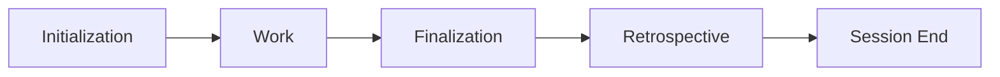

# Retrospective (Finalization Session Analysis) Skill

**Separate phase** after Finalization for strategic learning and session closure.

## Usage

```bash
/retrospective
python ~/.gemini/antigravity/skills/retrospective/scripts/finalization_debriefing.py
```

## Workflow



**Finalization** = Safe landing (quality gates, git, PR)  
**Retrospective** = Strategic learning (reflect, handoff, analysis)

## Finalization Debriefing Steps

### 1. Reflect

Invoke `/reflect` to:

- Capture learnings, preferences, and friction
- **Refactoring Identification**: Identify code that should be refactored (e.g., monolithic scripts, high complexity, pattern violations)
- Update SKILL.md files ("correct once, never again")
- Answer strategic questions (cognitive load, design patterns)

### 2. Handoff

Write the handoff artifact **before** providing the summary:

```python
import uuid, datetime, json, pathlib

agent    = "opencode"  # substitute your agent name
ts       = datetime.datetime.now().strftime("%Y%m%dT%H%M%S")
sid      = f"{agent}-{ts}-{uuid.uuid4().hex[:4]}"
handoff  = {
    "schema_version": "1.2",
    "session_id": sid,
    "agent": agent,
    "timestamp": datetime.datetime.now().isoformat(),
    "mode": "full",
    "status": "complete",
    "completed":  [],   # fill in
    "open_items": [],   # fill in
    "blockers":   [],
    "next_recommended": "",  # fill in
    "context": {"description": "", "beads_issue": None, "pr_url": None, "branch": None},
    "handoff_ready": True,
}
p = pathlib.Path.home() / f".agent/handoff/{sid}.json"
p.write_text(json.dumps(handoff, indent=2))
print(f"Handoff written: {sid}")
```

Then announce to the user:
> "Handoff written: `{sid}`. Next session: type `/continue` to auto-resume."

Then provide the human-readable summary:

- Work completed and deliverables
- Beads issues identifier (primary and created/closed)
- Skills used
- Recommended next steps (mirrors `next_recommended` in handoff artifact)

### 2a. Handoff Cleanup

```bash
python ~/.agent/skills/continue/scripts/cleanup_handoffs.py
```

Prunes old handoffs to the 20 most recent per agent, archives the rest.

### 3. Plan Cleanup

Clear the `## Approval` marker in task.md to prevent accidental auto-starts.

### 4. Strategic Analysis

Run `finalization_debriefing.py` to generate:

- Session summary and git activity
- Friction reduction opportunities
- Efficiency improvements (project and SOP level)
- Agentic design patterns for multi-agent collaboration

### 5. Orchestrator Verification

```bash
python ~/.gemini/antigravity/skills/Orchestrator/scripts/check_protocol_compliance.py --retrospective
```

Verifies:

- ✅ Reflection captured
- ✅ Debrief file generated
- ✅ Plan approval cleared

### 6. Protocol Compliance Reporting (MANDATORY)

Add the compliance verification result from the Orchestrator to your final session summary.

- Command: `python ~/.gemini/antigravity/skills/Orchestrator/scripts/check_protocol_compliance.py --finalize`
- Statement: **Protocol Compliance: 100% verified via Orchestrator.**

## Output

Debrief saved to: `~/.gemini/antigravity/brain/{session-id}/debrief.md`

## Strategic Questions

During reflection, address:

1. **Cognitive Load**: "Are there parts of SOP where the agent's cognitive load could be reduced by using scripts?"
2. **Design Patterns**: "Identify design patterns and recommended refactoring strategies."
3. **Multi-Agent**: "What improvements could enhance parallel agent workflows?"
4. **SOP Simplification Effectiveness**:
   - "Was SOP simplification proposed for this session? If so, was it approved?"
   - "If approved, did the simplified approach achieve goals efficiently?"
   - "Were there any quality issues with the simplified approach?"
   - "Should this simplification pattern be available for future similar tasks?"
5. **Documentation Review**:
   - "How easy was it to find all relevant documentation?"
   - "Did you encounter outdated or conflicting information?"
   - "Was the documentation scope appropriate for your needs?"
   - "What documentation improvements would help future work?"

## Integration

- **Finalization**: Runs after Finalization completion
- **Reflect**: Integrated as first debrief step
- **Orchestrator**: Verified via `--retrospective` flag
